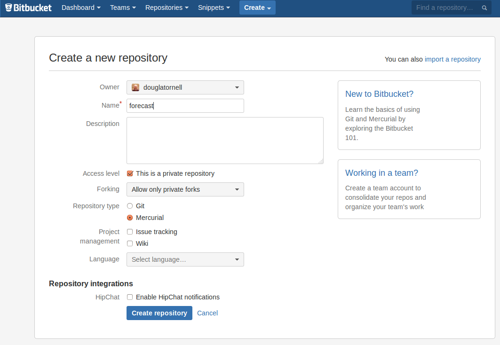
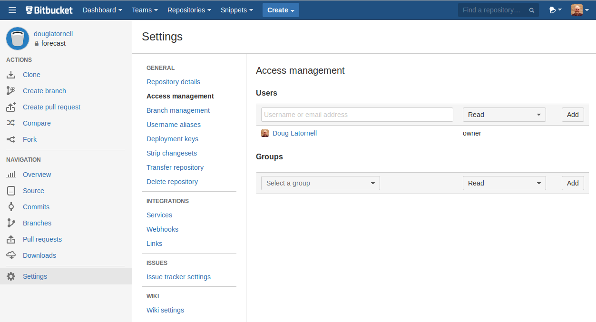

So far we've focused on how we can use Mercurial to keep track of work for ourselves,
on the one computer that we use all of the time,
or across several computers.
If you think about that as collaboration among your past,
present,
and future selves,
or as collaboration with yourself in different physical locations,
it is natural to extend those ideas to collaborating with other people --- your supervisor,
lab-mates,
colleagues in other groups,
departments,
and institutions,
and perhaps even people on the Internet that you've never met.

The key to bringing other people into the picture is having a copy of your repository in a network accessible location,
and we've already learned how to do that easily via Bitbucket.

Looking again at the `Create Repository` page on Bitbucket:

we can see the `Access Level` setting that allows us to choose whether the repository will be private or public.

In a private repository the only person who initially has access to the repository is the owner --- the person who created it.
All other access,
whether it be read or write,
must be granted explicitly by the repo owner.

Public repositories,
on the other hand,
are readable by anyone who chooses to look at the URL.
That means that anyone who wants to can create a clone of a public repository and make whatever changes they want *in their own clone*.
The repository owner still has control over who can write to the repository,
so those changes can't be pushed back to the original repo without the owner's consent.

Bitbucket offers other public repo features to facilitate collaboration:

* Per-repository issue trackers for project management and bug reports
* Per-repository wikis for documentation
* Email notifications of various events such as pushed commits,
new issue creation,
etc.
* Forks and pull requests for code review,
and contributions from users without write permission to the repo

Beyond the public/private setting for a Bitbucket repository,
who can do what in a repository is controlled via the `Access management` panel in the repository `Settings` section:

You can control access at the level of individual users via their Bitbucket user names,
or you can associate users with groups that all have the same access level.
The access levels are:

* `Read` --- read-only (includes cloning the repo)
* `Write` --- read-write (enables pushing changes into the repo)
* `Admin` --- read-write plus the ability to change permissions for other users and change all Bitbucket repo settings
